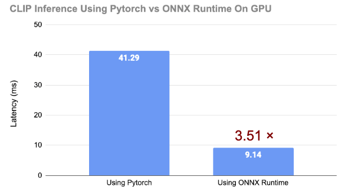

# Inference PyTorch CLIP Model with ONNX Runtime on CPU

## Introduction

This tutorial will introducee to how convert HuggingFace [CLIP Model](https://huggingface.co/openai/clip-vit-base-patch32) to ONNX, and inference it for high performance using ONNX Runtime On GPU. See the below comparisons between native pytorch and onnx on gpu inference, we notice that ONNX can much accelebrate the inference and it has been one of best choice for deployment of our LLM models for cost saving and more efficiency.

And, now we try to convert CLIP to ONNX and inference it using ONNX Runtime !

Please follow the tutorial colab to try it out:

## Conclusion:
Using ONNX Runtime is 3.51 × Faster than using Pytorch on GPU infernece.

CLIP only takes 9 ms inferencing an images whereas pytorch takes 41 ms in average. 
</img>

## Referene:
Medium post about accelerating other Hugging Face models:

https://medium.com/microsoftazure/accelerate-your-nlp-pipelines-using-hugging-face-transformers-and-onnx-runtime-2443578f4333

</img>

